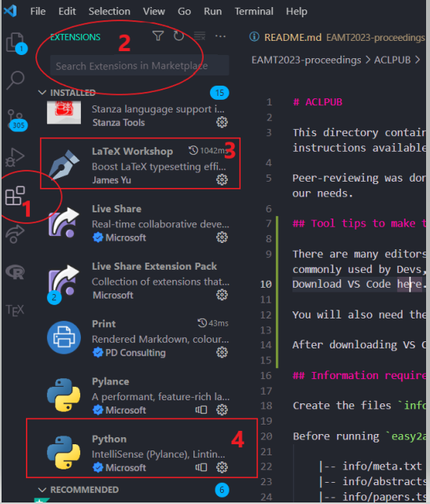
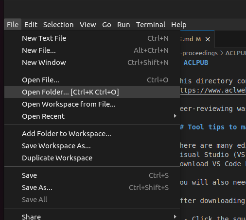
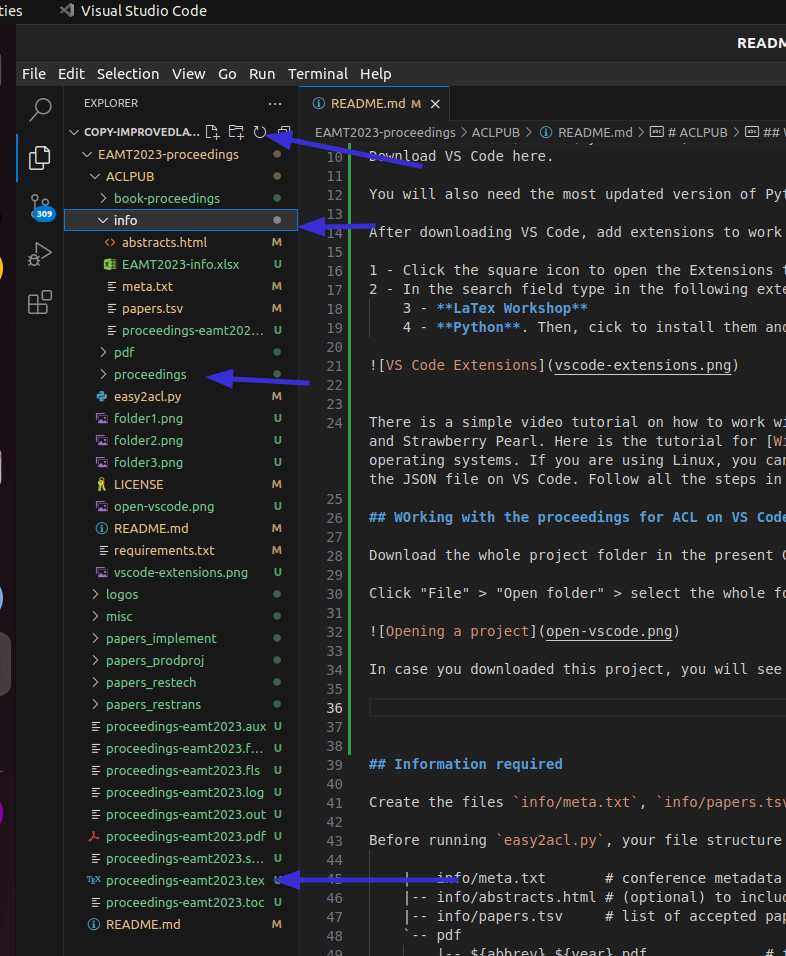
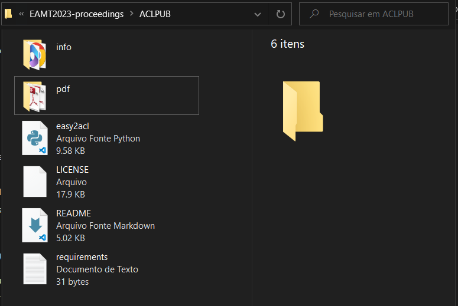
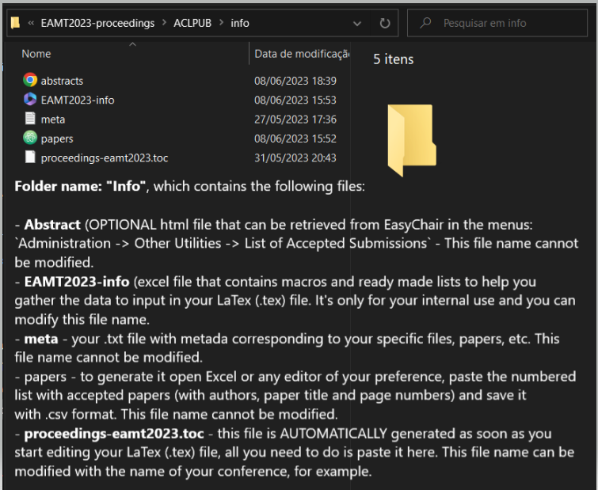
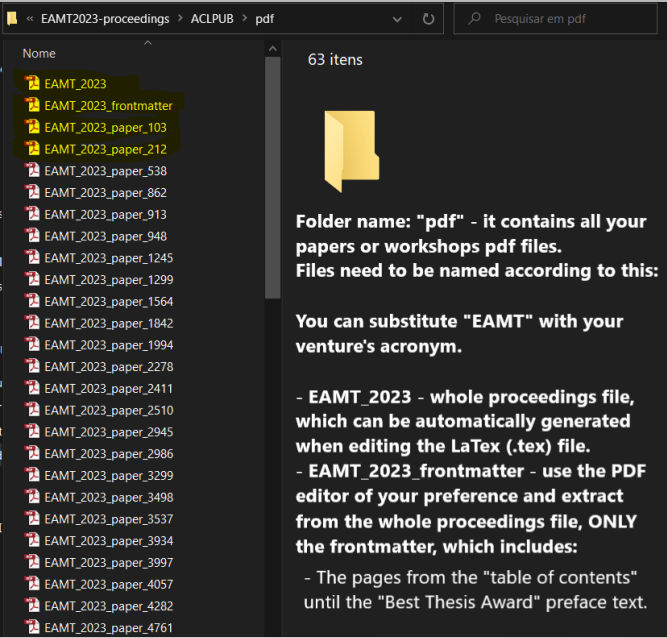
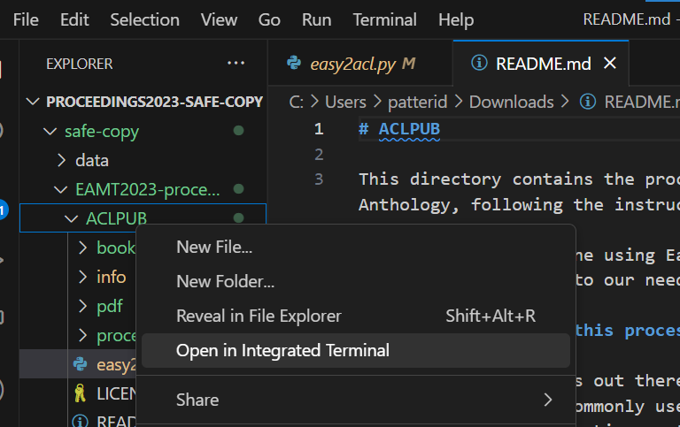
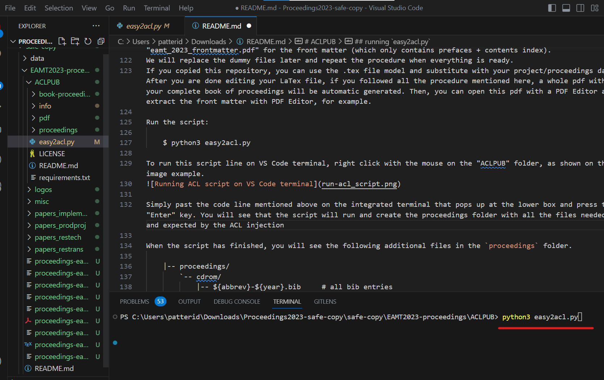
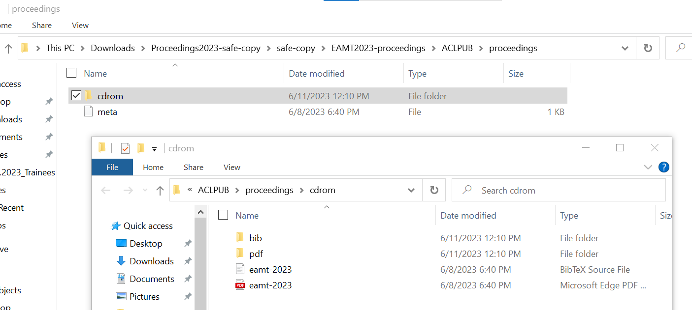

# ACLPUB

This directory contains the procedure to add the proceedings and all the corresponding papers to the ACL Anthology, following the instructions available at https://www.aclweb.org/anthology/info/contrib/

Peer-reviewing was done using EasyChair. So, the script `easy2acl.py` available at https://github.com/acl-org/easy2acl was adapted to our needs.

## Tool tips to make this process as easy as possible

There are many editors out there to work on LaTex files. However, I decided to only use open-source and free tools that are most commonly used by Developers, such as Visual Studio (VS) Code (by Microsoft, but runs in different operating systems like Mac, Linux, etc.)
Download VS Code [here](https://code.visualstudio.com/download).

You will also need the most updated version of Python for your system and to run the scripts, you can install it [here](https://www.python.org/downloads/).

After downloading and installing VS Code and Python on your system, also add extra VS Code extensions to work with LaTex files and Python Scripts.

Here is where you can install VS Code extensions directly from the program:

1 - Click the square icon to open the Extensions tab.  
2 - In the search field type in the following extension names:  
    3 - **LaTex Workshop**  
    4 - **Python**. Then, click the button to install them and after it is complete, restart the program.      

  

There is a simple video tutorial on how to work with LaTex files and render pdf files from them for free using tools like VS Code, LaTex Workshop, MikTex and Strawberry Pearl. This video also explains how to install VS Code. Here is the tutorial for [Windows](https://www.youtube.com/watch?v=4lyHIQl4VM8) and [Mac](https://www.youtube.com/watch?v=CmagZthwhaY) operating systems. If you are using Linux, you can follow a similar procedure for WIndows, but you will need only the LaTex Workshop extension, MikTex and adjust the JSON file on VS Code. Follow all the steps in the video, then proceed to opening a LaTex project to work on VS Code.

## Working with the proceedings for ACL on VS Code

Download the whole project folder in this GitHub repository, extract it and open as the following on VS Code:

Click "File" > "Open folder" > select the whole folder where your project is located on your computer > click "Open".

In case you downloaded this project, you will see the whole project folder in the file explorer on VS Code with all its folders and sub-folders.
You can also use the .tex (LaTex) file as a template and replace the text information and links with your own proceedings text, links and papers.

**NOTE:** The pdf folder in this repository only contains partial files as mere examples and it's not complete with all the papers that were included in the EAMT Conference. So, you should use it only as a guide and substitute all the pdf files with your own proceedings papers. The script only runs and works correctly after you included all your paper pdf files there, which have to be correctly  linked in the `\addpaper{}` section on your .tex file (LaTex).

## Information required

Create the files `info/meta.txt`, `info/papers.tsv`, `info/abstracts.html` (optional), and the folder `pdf` as shown. 

Before running `easy2acl.py`, your file structure should look like this:

    |-- info/meta.txt       # conference metadata
    |-- info/abstracts.html # (optional) to include abstracts
    |-- info/papers.tsv     # list of accepted papers
    `-- pdf
        |-- ${abbrev}_${year}.pdf              # full volume of consolidated PDFs
        |-- ${abbrev}_${year}_frontmatter.pdf  # front matter of proceedings
        |-- ${abbrev}_${year}_paper_1.pdf
        |-- ${abbrev}_${year}_paper_2.pdf
        `-- ...

(where `${abbrev}` and ${year} are defined in the `info/meta.txt` file, see below)

All the required information can be retrieved from EasyChair or easily provided by you. More details can be found in [Getting data from EasyChair](https://github.com/acl-org/easy2acl/#getting-data-from-easychair).

Here are screenshots of how your folders on Windows should look like to make it a bit more descriptive:

The ACL folder should contain the sub-folders named exactly "info" with your specific project information, "pdf" with all the pdf files that are going to be added.

 

The subfolder info should contain an .html file with your abstracts (optional), a .tsv file with your papers index, a .txt with metadata and the .toc file, which is automatically generated when you edit your LaTex proceedings .tex file (copy the .toc to this folder after you're done with your LaTex project before running the Python script).

Copy all your pdfs to this folder. 

###  Creating the info/papers.tsv file

Tab-separated file, containing 3 or 4 columns: `paper id`, `authors`, `title`, `initial page` (optional)
It accepts comments and empty lines, as shown in the example.

Example:

    # EAMT 2019 Best Thesis Award --- Anthony C Clarke Award			
    901 John Smith	Nice title	5

    # Research		
    21	John Smith, Peter Nice and Anna Cool	Super-nice Title 	9
    29	Tom Cool and Peter Smith	Really nice title	19
    34	Hao Wang, Wang Lee, Xi Yung and Lu Yu	Super cool title    27
    ...
 
If you produced your proceedings with LaTeX, it generates a temporary file containing the initial page of each section. Assuming that the papers are following the exact same order of the proceedings. The page numbers can be pseudo-automatically generated based on this file, as follows:

    cat proceedings.toc| grep "\\contentsline {section}" | awk -F'}{' '{print $3, "%", $2}' > pages.txt

Extra information about this `cat`code line: This step is quite technical and requires you to open a terminal in the same folder your `proceedings.toc` file is located. I like using Git Bash for this. If you wish, you can download it [here](https://git-scm.com/downloads). Then, you open the folder where your `proceedings.toc` file is, right click with the mouse in the folder, choose the option "Git Bash Here" and just copy-paste or type the line code mentioned above. Remember the `proceedings.toc` file name needs to be same as your automatically generated one while editing the LaTex file`. You should correct it if it has a different name. Otherwise, this code line will not run.

This will create a table of contents with your proceedings index in LaTex Format. This content can be used to create your "papers.tsv" file.
Or, if you prefer, your list of "Contents" with authors, paper names and page numbers can be inserted manually, which is not recommend, since manually doing it could generate typos, mistakes, etc.
 
 
### Creating the info/abstracts.html (optional)  

It can be produced, based on the EasyChair information menu `Administration -> Other Utilities -> List of Accepted Submissions`, and then selecting `Download the list`. The automatic generated HTML is well-formated and contains the information bellow.

Open this html file with a common text editor like "Notepad++" or "VS Code" itself. 
You will just need to clean and edit it a little bit to delete the extra junk content and extra tags that come in the beginning and around the html text file. If you don't clean and format this properly, the script might not work correctly to gather the abstracts.
**Only** leave the following html `
` tag lines, which also contain paper specific content like "paper", "authors", "title" and "abstract".

Example:

    

     ... 
    ...

    
....

    

     ... 
    ...

    
....

    ...
    
## running `easy2acl.py`

When you run the script for the first time, create a dummy pdf file (which is just a blank/empty pdf file) for the full volume consolidated PDF file and the front matter proceedings file using the above file naming convention. Save these dummy pdf files in the pdf folder, if you do not have the LaTex proceedings ready, you can substitute them later on an run the script as many times as you wish. Remember to name these files using the file title convention mentioned above. E.g.: "eamt_2023.pdf" for the full volume of consolidated PDFs "eamt_2023_frontmatter.pdf" for the front matter (which only contains prefaces + contents index).

We will replace the dummy files later and repeat the procedure when everything is ready.
If you copied this repository, you can use the .tex file model and substitute with your project/proceedings data. After you are done editing your LaTex file, if you followed all the procedure mentioned here, a whole pdf with your complete book of proceedings will be automatic generated. Then, you can open this pdf with a PDF Editor and extract the front matter with PDF Editor, for example.

Run the script:

    $ python3 easy2acl.py

If necessary, also run the following scripts in the same way and folder described above to install some requirements.

    $ pip install requirements.txt

or

    $ pip -r bin/requirements.txt

Here are some ways to run these scripts on VS Code:

Right click with the mouse on the "ACLPUB" folder, as shown on the image example:

Simply past the code line mentioned above on the integrated terminal that pops up at the lower box and press the "Enter" key. 

You will see that the script will run and create the proceedings folder with all the files needed and expected by the ACL injection. When the script has finished, you will see the following additional files in the `proceedings` folder.

    |-- proceedings/
        `-- cdrom/
            |-- ${abbrev}-${year}.bib     # all bib entries
            |-- ${abbrev}-${year}.pdf     # entire volume
            |-- bib/
            |   |-- {year}.{abbrev}-{volume_name}.0.bib  # frontmatter
            |   |-- {year}.{abbrev}-{volume_name}.1.bib  # first paper
            |   |-- {year}.{abbrev}-{volume_name}.2.bib  # second paper
            |   `-- ...
            `-- pdf/
                |-- {year}.{abbrev}-{volume_name}.0.pdf  # frontmatter
                |-- {year}.{abbrev}-{volume_name}.1.pdf  # first paper
                |-- {year}.{abbrev}-{volume_name}.2.pdf  # second paper
                `-- ...

Here is also a screenshot to illustrate the proceedings folder and its contents produced by the Easy2acl script (taken from Windows OS).

This is the input format that [the ingestion scripts for the ACL Anthology](https://github.com/acl-org/ACLPUB) expect and this is the folder that will need to be compacted before sharing.

The `easyacl.py` script also creates a file `book-proceedings/all_papers.tex` which contains an index of files that is read in automatically by `book-proceedings.tex`.
This document can be used to generate a full volume consolidated PDF file.
This file contains front matter (which you should edit), and automatically creates a table of contents and includes all papers from `all_papers.tex`.
To create the book proceedings simply edit the front matter and recompile `book_proceedings.tex`.
Copy `book-proceedings.pdf` to `${abbrev}_${year}_frontmatter.pdf` in your `pdf` folder.
To create `${abbrev}_${year}_frontmatter.pdf` extract the front matter pages with roman page numbers from `book-proceedings.pdf`.
Finally, re-run `python3 easy2acl.py` to replace the dummy full book proceedings and front matter files in the `proceedings` folder that you will use in the next step.

Once this data is generated, you can proceed with ACLPUB to generate the XML ingestion file and layout that the Anthology requires.

